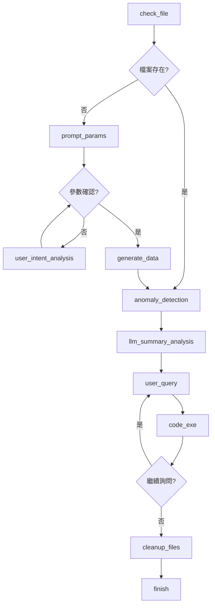

# 智能感測器異常檢測系統 (Agentic AI Workflow)

這是一個基於 **Agentic AI Workflow** 的智能感測器異常檢測系統，整合了 LangGraph、LLM 自然語言交互和機器學習模型，提供從數據生成到異常檢測的完整解決方案。

## 🚀 系統特色

- **🤖 Agentic AI Workflow**: 基於 LangGraph 的智能工作流程管理
- **💬 自然語言交互**: 使用 Gemini 2.5 Pro 進行參數設定和問答
- **🔄 自動化流程**: 檢查資料 → 智能對話 → 生成資料 → 異常檢測 → 智能分析 → 數據探索
- **📊 雙重檢測**: 規則基礎 + 機器學習模型的異常檢測
- **🔍 智能數據查詢**: LLM 驅動的自然語言數據分析系統
- **⚡ 自動代碼生成**: 根據問題自動生成並執行 pandas 分析代碼
- **🎨 視覺化工作流**: 自動生成 Mermaid 工作流程圖

## 📁 項目結構

```
和碩作業3/
├── 🤖 主要工作流程
│   ├── agentic_workflow.py          # 主要 Agentic AI Workflow (LangGraph)
│   └── workflow.png                 # 工作流程視覺化圖表
├── 🛠️ 核心功能模組
│   ├── generate_data.py             # 感測器數據生成器
│   ├── checking_agent.py            # 異常檢測代理 (Rule + ML)
│   ├── preprocessing.py             # 數據預處理器
│   └── training_model.py            # 神經網路模型訓練
├── 📊 數據與模型
│   ├── Data/
│   │   ├── training.csv             # 訓練數據
│   │   ├── testing.csv              # 測試數據 (動態生成)
│   │   └── testing_50.csv           # 小型測試數據
│   └── model_weight/
│       ├── sensor_classifier.pth    # 訓練好的 PyTorch 模型
│       └── preprocessing_stats.pkl  # 預處理統計信息
├── 🔧 配置檔案
│   ├── requirements.txt             # Python 依賴套件
│   ├── API_key.txt                  # Google Gemini API Key
│   └── README.md                    # 本說明文件
└── 📈 輸出檔案
    └── training_history.png         # 模型訓練歷史圖表
```

## 🚀 快速開始

### 1. 安裝依賴套件

```bash
pip install -r requirements.txt
```

### 2. 設定 Google Gemini API Key

在根目錄建立 `API_key.txt` 檔案，內容為你的 Google API Key：
```
your_google_api_key_here
```

### 3. 運行 Agentic Workflow

```bash
# 基本運行
python agentic_workflow.py

# 顯示工作流程圖
python agentic_workflow.py -p

# 測試簡單工作流程
python agentic_workflow.py -t
```

## 🐳 Docker 部署

### 快速開始 (使用預建 Docker Image)

我們提供了預建的 Docker Image，包含所有必要的依賴環境，讓你可以快速開始使用：

**📦 Docker Image 連結**: [iirguanyu/agentic-ai-workflow:latest](https://hub.docker.com/layers/iirguanyu/agentic-ai-workflow/latest/images/sha256:735477c58af4ec20bba258dccc2adae5c0a9deb67d8da41e113b8848caa1190c?uuid=C9148786-9A31-4385-9BEB-5F1C032707CD)

```bash
# 1. 拉取預建的 Docker Image
docker pull iirguanyu/agentic-ai-workflow:latest

# 2. 運行容器並 mount 你的專案目錄
docker run -it --rm -v "${PWD}:/workspace" -w /workspace iirguanyu/agentic-ai-workflow:latest bash

# 3. 在容器內運行系統
python agentic_workflow.py
```

### Docker Image 特色

- **🔧 完整環境**：Python 3.11 + 所有 AI/ML 依賴套件
- **📦 體積**：壓縮後 ~8GB，解壓縮後 ~20GB
- **⚡ 即用**：無需安裝任何依賴，直接運行
- **🌐 公開倉庫**：任何人都可以直接拉取使用
- **🔗 官方連結**：[Docker Hub Image 詳情](https://hub.docker.com/layers/iirguanyu/agentic-ai-workflow/latest/images/sha256:735477c58af4ec20bba258dccc2adae5c0a9deb67d8da41e113b8848caa1190c?uuid=C9148786-9A31-4385-9BEB-5F1C032707CD)

### 🚀 立即開始使用

這個 Docker Image 是 **公開的**，任何人都可以直接拉取和使用，無需授權：

```bash
# 直接拉取（無需登入 Docker Hub）
docker pull iirguanyu/agentic-ai-workflow:latest
```

### Docker 使用範例

```bash
# 進入 Docker 環境
docker run -it --rm -v "${PWD}:/workspace" -w /workspace iirguanyu/agentic-ai-workflow:latest bash

# 在容器內執行
root@container:/workspace# python agentic_workflow.py

# 或者直接執行（不進入互動模式）
docker run --rm -v "${PWD}:/workspace" -w /workspace iirguanyu/agentic-ai-workflow:latest python agentic_workflow.py
```

## 🤖 Agentic AI Workflow 詳細說明

### 工作流程架構



### 流程步驟說明

1. **檢查檔案 (check_file)**
   - 檢查 `Data/testing.csv` 是否存在
   - 如果存在，直接進行異常檢測
   - 如果不存在，啟動智能參數設定

2. **智能參數設定 (prompt_params)**
   - 顯示預設參數 (行數: 300, 正常機率: 0.95, 異常機率: 0.3, 空值機率: 0.05)
   - 等待用戶輸入指令或問題

3. **用戶意圖分析 (user_intent_analysis)**
   - 使用 **Gemini 2.5 Pro** 分析用戶自然語言輸入
   - 自動解析參數修改指令 (格式: `[PARAM_UPDATE] param=value [/PARAM_UPDATE]`)
   - 即時更新參數並顯示確認訊息
   - 支援循環對話直到用戶確認

4. **數據生成 (generate_data)**
   - 使用確認的參數執行 `generate_data.py`
   - 生成 `Data/testing.csv`

5. **異常檢測 (anomaly_detection)**
   - 載入 `DataQualityAgent`
   - 執行 Rule-based + Model-based 綜合檢測
   - 保存統計結果到 `Data/total_stat.txt`

6. **智能分析總結 (llm_summary_analysis)**
   - 使用 **Gemini 2.5 Pro** 分析檢測統計結果
   - 提供專業的系統健康評估和建議
   - 包含問題識別、原因分析、行動建議

7. **智能數據查詢 (user_query)**
   - 提供自然語言數據查詢介面
   - LLM 自動判斷是否需要生成分析代碼
   - 支援概念性問題和數據分析問題

8. **代碼執行 (code_exe)**
   - 自動生成並執行 pandas 分析代碼
   - 具備錯誤重試機制（最多 3 次）
   - 捕獲並顯示代碼執行結果
   - 支援循環查詢模式

9. **清理檔案 (cleanup_files)**
   - 自動清理暫存統計檔案

### 自然語言交互範例

```
🤖 智能參數設定助手已啟動！
📋 當前預設參數：
   - 資料行數 (num_rows): 300
   - 正常資料感測器正常機率 (normal_prob): 0.95
   - 異常資料感測器正常機率 (abnormal_prob): 0.3
   - 空值機率 (null_prob): 0.05

你: 我想要500筆資料
✅ 已更新資料行數為: 500

你: 正常機率調低一點
✅ 已更新正常資料感測器正常機率為: 0.8

你: 什麼是空值機率？
🤖 助手: 空值機率是指每個感測器在每筆資料中出現空值（null或缺值）的機率...

你: yes
✅ 確認使用參數生成資料！
```

### LLM 意圖分析機制

系統使用 **prompt engineering** 讓 Gemini 理解用戶意圖：

1. **參數分析**: LLM 分析用戶是否想修改參數
2. **標準化輸出**: 參數修改以固定格式輸出 `[PARAM_UPDATE] param=value [/PARAM_UPDATE]`
3. **自動解析**: 程式解析 LLM 輸出並更新狀態
4. **即時反饋**: 立即顯示參數更新結果

### 🔍 智能數據查詢系統

系統整合了強大的自然語言數據分析功能：

#### 查詢類型自動判斷
```
Code_flag: yes/no
Response: <回答或分析說明>
```

- **概念性問題** (`Code_flag: no`): 直接由 LLM 回答
- **數據分析問題** (`Code_flag: yes`): 自動生成並執行 pandas 代碼

#### 自動代碼生成與執行

1. **智能代碼生成**: 根據問題自動生成 pandas 分析代碼
2. **執行環境隔離**: 安全的代碼執行環境
3. **輸出捕獲**: 完整捕獲並顯示代碼執行結果
4. **錯誤重試**: 自動錯誤檢測和代碼修正（最多 3 次）

#### 支援的查詢範例

**數據統計類**：
- "數據總共有幾行？"
- "溫度的平均值是多少？"
- "有多少個異常數據？"
- "各感測器的空值數量統計"

**數據分析類**：
- "正常和異常數據的比例"
- "溫度超過 50 度的資料筆數"
- "每個感測器的異常比例"

**概念解釋類**：
- "什麼是溫度感測器？"
- "異常檢測的原理是什麼？"
- "為什麼要進行數據預處理？"

#### 數據查詢體驗

```
================================================================================
📊 數據查詢助手
================================================================================
您可以詢問關於 Data/testing.csv 的任何問題，例如：
- 數據總共有幾行？
- 溫度的平均值是多少？
- 有多少個異常數據？
- 輸入 'quit' 或 '結束' 退出查詢模式
================================================================================

🤔 請輸入您的問題: 數據有幾行？

🤖 分析結果：我將計算數據的總行數

🔧 正在生成分析代碼...
================================================================================
🔧 生成的代碼：
================================================================================
import pandas as pd
df = pd.read_csv('Data/testing.csv')
total_rows = df.shape[0]
print(f"總數: {total_rows}")
================================================================================
⚡ 執行中...
================================================================================
📊 執行結果：
總數: 300

================================================================================
✅ 代碼執行成功！

================================================================================
❓ 是否要繼續詢問其他問題？(y/n): 
```

## 📊 感測器參數規格

| 感測器 | 正常範圍 | 異常範圍 | 單位 |
|--------|----------|----------|------|
| 溫度 (temp) | 45-50°C | >52°C 或 <43°C | °C |
| 壓力 (pressure) | 1.00-1.05 | >1.08 或 <0.97 | - |
| 振動 (vibration) | 0.02-0.04 | >0.07 | - |

## 🔧 核心模組詳細說明

### 1. 數據生成器 (`generate_data.py`)

生成符合工業感測器特性的模擬數據：

```bash
# 使用 Agentic Workflow 生成 (推薦)
python agentic_workflow.py

# 直接生成
python generate_data.py -n 500 -o Data/testing.csv --normal_prob 0.95 --abnormal_prob 0.3 --null_prob 0.05
```

**參數說明**:
- `num_rows`: 資料行數
- `normal_prob`: normal 標籤時感測器在正常值域的機率
- `abnormal_prob`: abnormal 標籤時感測器在正常值域的機率  
- `null_prob`: 產生空值的機率

### 2. 數據預處理器 (`preprocessing.py`)

支援 training 和 eval 兩種模式的數據預處理：

```python
from preprocessing import DataPreprocessor

preprocessor = DataPreprocessor()

# Training 模式: 計算並保存統計信息
training_data = preprocessor.process("Data/training.csv", mode='training')

# Eval 模式: 使用已保存統計信息
eval_data = preprocessor.process("Data/testing.csv", mode='eval')
```

**功能特色**:
- Z-score 標準化
- 均值填充缺失值
- 統計信息持久化存儲

### 3. 模型訓練 (`training_model.py`)

PyTorch 神經網路模型訓練：

```bash
python training_model.py
```

**模型架構**:
```
Input(3) → Dense(64) → ReLU → Dropout(0.2) 
         → Dense(32) → ReLU → Dropout(0.2) 
         → Dense(2) → Softmax
```

**性能指標**:
- 準確率: ~92%
- 訓練時間: ~100 epochs
- 支援 GPU 加速

### 4. 異常檢測代理 (`checking_agent.py`)

綜合 Rule-based 和 Model-based 的異常檢測：

```bash
# 使用 Agentic Workflow 檢測 (推薦)
python agentic_workflow.py

# 直接檢測
python checking_agent.py Data/testing.csv
```

**檢測方法**:
- **Rule-based**: 基於感測器值域的規則檢測
- **Model-based**: 使用訓練好的神經網路模型
- **空值檢測**: 自動識別缺失數據
- **智能建議**: 根據異常類型提供修復建議

**輸出範例**:
```
行 15 | 2024-06-03 19:14:00 | TEMP=52.5°C | PRESSURE=1.10 | VIBRATION=0.08
[RULE-ALERT] 溫度偏高 (正常範圍: 45-50°C), 壓力偏高 (正常範圍: 1.00-1.05), 振動偏高 (正常範圍: 0.02-0.04)
建議: 檢查冷卻系統, 檢查產品壓力狀況, 檢查設備固定
[MODEL-ALERT] abnormal (分數: 0.875)
建議: 檢查所有感測器及產品狀況, 進行設備維護檢查
```

## 🎨 工作流程視覺化

系統支援自動生成 Mermaid 工作流程圖：

```bash
# 生成工作流程圖
python agentic_workflow.py -p
```

**多層次備援機制**:
1. **雲端 API** (mermaid.ink)
2. **本地 mermaid-cli** 
3. **Python requests** (mermaid.ink API)
4. **PIL 簡易示意圖**

## 🔄 完整使用範例

### 情境 1: 完整工作流程 (從數據生成到智能分析)

```bash
python agentic_workflow.py
```

```
[!] Data/testing.csv 不存在，啟動智能參數設定助手...

================================================================================
🤖 智能參數設定助手已啟動！
📋 當前預設參數：
   - 資料行數 (num_rows): 300
   - 正常資料感測器正常機率 (normal_prob): 0.95
   - 異常資料感測器正常機率 (abnormal_prob): 0.3
   - 空值機率 (null_prob): 0.05

💬 你可以：
   - 詢問任何關於參數的問題
   - 修改參數（例如："設定行數為500"）
   - 輸入 'yes' 開始用當前參數生成資料
================================================================================

你: 產生1000筆資料，空值機率提高到10%

================================================================================
✅ 已更新資料行數為: 1000
✅ 已更新空值機率為: 0.1

📋 更新後的參數：
   - 資料行數 (num_rows): 1000
   - 正常資料感測器正常機率 (normal_prob): 0.95
   - 異常資料感測器正常機率 (abnormal_prob): 0.3
   - 空值機率 (null_prob): 0.1
================================================================================

你: yes

================================================================================
✅ 確認使用參數生成資料！
================================================================================

[Agentic Workflow] 執行 generate_data.py 產生測試資料...
✅ 測試數據生成成功!

[Agentic Workflow] 開始異常檢測...
🚨 開始逐行異常檢測 (Rule-based + Model-based)
...
[✓] 異常檢測完成！處理了 1000 行資料

================================================================================
🤖 LLM 智能分析總結
================================================================================
## 系統整體健康狀況評估：需注意

### 主要問題識別：
1. **高空值比例**：感測器空值達到 10%，遠超正常水準
2. **數據完整性問題**：大量缺失值影響分析準確性

### 根本原因分析：
可能原因包括感測器連接不穩定、數據傳輸中斷或設備老化...

### 具體行動建議：
1. 立即檢查感測器連接狀態
2. 更換老化的感測器設備
3. 實施預防性維護計劃

### 預防措施建議：
建立定期校準機制，加強設備監控...
================================================================================

================================================================================
📊 數據查詢助手
================================================================================
您可以詢問關於 Data/testing.csv 的任何問題，例如：
- 數據總共有幾行？
- 溫度的平均值是多少？
- 有多少個異常數據？
- 輸入 'quit' 或 '結束' 退出查詢模式
================================================================================

🤔 請輸入您的問題: 溫度的平均值是多少？

🤖 分析結果：我將計算溫度的平均值

🔧 正在生成分析代碼...
================================================================================
🔧 生成的代碼：
================================================================================
import pandas as pd
import numpy as np

df = pd.read_csv('Data/testing.csv')
temp_mean = df['temp'].mean()
print(f"溫度平均值: {temp_mean:.2f}°C")
================================================================================
⚡ 執行中...
================================================================================
📊 執行結果：
溫度平均值: 47.52°C

================================================================================
✅ 代碼執行成功！

================================================================================
❓ 是否要繼續詢問其他問題？(y/n): n
👋 感謝使用數據查詢助手！

[✓] Agentic Workflow 完成！
```

### 情境 2: 資料已存在 (直接檢測與分析)

```bash
python agentic_workflow.py
```

```
[Agentic Workflow] 開始異常檢測...
🚨 開始逐行異常檢測 (Rule-based + Model-based)
...
[✓] 異常檢測完成！處理了 500 行資料

================================================================================
🤖 LLM 智能分析總結
================================================================================
## 系統整體健康狀況評估：良好

### 主要問題識別：
1. **輕微溫度異常**：檢測到 3 個溫度異常值
2. **振動輕微偏高**：2 個振動讀數超過正常範圍

### 根本原因分析：
可能是正常的操作變化，無需立即擔心...
================================================================================

================================================================================
📊 數據查詢助手
================================================================================
🤔 請輸入您的問題: quit
👋 感謝使用數據查詢助手！

[✓] Agentic Workflow 完成！
```

### 情境 3: 生成工作流程圖

```bash
python agentic_workflow.py -p
```

```
[✓] workflow.png 已儲存 (雲端 API)
```

## 🛠️ 技術架構

### 核心技術棧

- **🔗 LangGraph**: 狀態管理和工作流程編排
- **🤖 LangChain**: LLM 整合和 prompt 管理  
- **🧠 Google Gemini 2.5 Pro**: 自然語言理解、代碼生成和智能分析
- **🔥 PyTorch**: 深度學習模型訓練和推理
- **📊 Pandas + NumPy**: 數據處理和分析
- **⚡ Dynamic Code Execution**: 安全的 Python 代碼動態執行環境
- **📈 Matplotlib**: 數據視覺化和圖表生成
- **🎨 Mermaid**: 工作流程圖表生成

### 狀態管理

使用 `WorkflowState` TypedDict 管理工作流程狀態：

```python
class WorkflowState(TypedDict):
    # 數據參數
    num_rows: int
    normal_prob: float
    abnormal_prob: float
    null_prob: float
    
    # 檔案狀態
    file_exists: bool
    data_path: str
    output: str
    
    # 處理狀態  
    data_generated: bool
    anomaly_checked: bool
    
    # 對話狀態
    user_input: str
    llm_response: str
    params_confirmed: bool
    conversation_active: bool
    
    # 分析與查詢狀態
    summary_saved: bool
    llm_summary_generated: bool
    user_question: str
    code_flag: str
    llm_code_response: str
    code_execution_result: str
    code_error: str
    query_completed: bool
    continue_asking: bool
```

### LLM Prompt Engineering

系統使用精心設計的 prompt 來實現準確的意圖理解：

```python
intent_prompt = f"""你是參數修改意圖分析專家。請分析用戶的輸入，判斷是否要修改參數。

當前參數狀態：
- num_rows: {current_num_rows}
- normal_prob: {current_normal_prob}
- abnormal_prob: {current_abnormal_prob}
- null_prob: {current_null_prob}

用戶輸入："{user_input}"

請分析用戶是否想要修改任何參數。如果是，請按照以下格式輸出：

[PARAM_UPDATE]
param_name=new_value
[/PARAM_UPDATE]

如果用戶只是詢問問題而不是要修改參數，請正常回答問題。
"""
```
